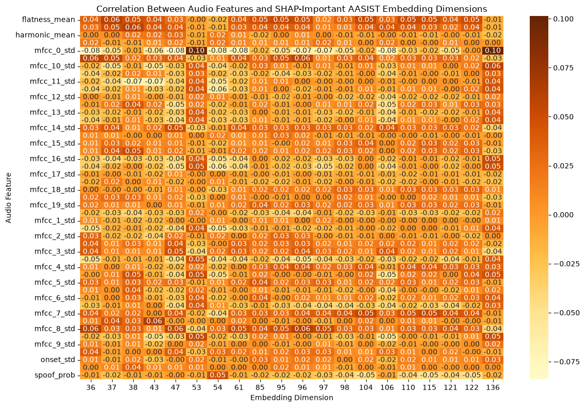
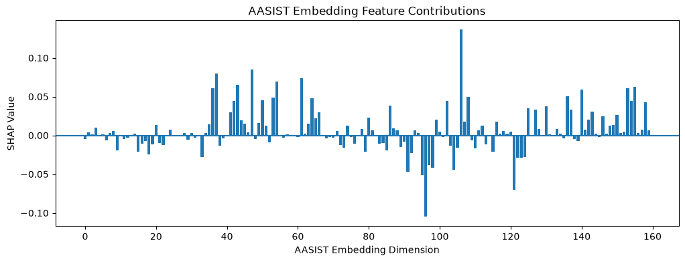
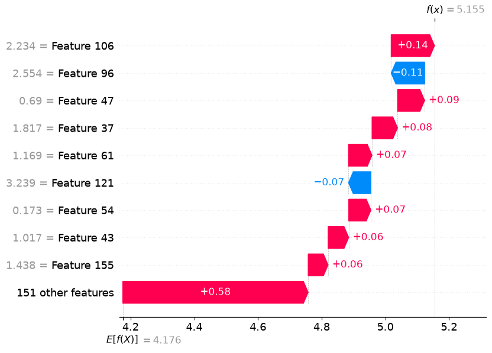

### **Overview of SHAP vs. LIME**

| SHAP                               | LIME                                |
|------------------------------------|-------------------------------------|
| broader feature contribution       | identifies local cues               |
| more stable attribution            | isolated spoof artifacts            |
| big picture                        | frequency hotspots                  |
| better for transformer-based models| computationally cheaper             |
| Spectrogram heatmaps               | can be noisy/ hard to interpret     |

# AASIST V3 Explainability

## Project Overview

This project explores explainability techniques for an Automatic Speaker Verification (ASV) spoofing detection model, with a primary focus on the **AASIST V3** architecture. The goal was to better understand which characteristics of an audio sample influence the model's spoofing predictions.

Multiple explainability methods were evaluated throughout this project. Initial experiments were conducted using both **SHAP** and **LIME** across different model architectures. After determining that **AASIST V3** provided the strongest overall performance, the explainability analysis was focused exclusively on this model.

---

## Explainability Approaches

### LIME

LIME was initially investigated as a potential explainability method. However, due to the architecture of the AASIST V3 model, LIME could not be successfully applied in a meaningful way. The model's input representation and processing pipeline are not well suited to LIME's perturbation-based approach.

### SHAP

SHAP was successfully implemented, although with important limitations.

Unlike previous experiments performed on a Wav2Vec2-based model, SHAP was not able to attribute importance directly to interpretable audio features (such as MFCCs or other acoustic descriptors). Instead, SHAP could only estimate feature importance for the model's **106-dimensional embedding space**.

This analysis revealed that some embedding dimensions consistently contributed more heavily to the model's predictions than others, providing insight into which internal representations the model relies on most. However, the embedding dimensions themselves are latent features and do not have an intuitive interpretation.

---

## Interpreting the Embeddings

Because the embedding dimensions are not inherently meaningful to humans, an additional analysis was performed to investigate whether they corresponded to recognizable acoustic characteristics.

A set of interpretable audio features was extracted directly from the ASVspoof 2019 LA audio files, including commonly used acoustic descriptors such as spectral, temporal, and energy-based features. These extracted features were then compared with the learned embedding dimensions using correlation analysis.

The goal was to determine whether highly influential embedding dimensions represented familiar audio characteristics such as:

* Pitch
* Loudness (volume)
* Background noise
* White noise
* Other interpretable acoustic properties

---

## Results

The correlation analysis did not reveal any strong relationships between the extracted audio features and the learned embedding dimensions.

This suggests that the AASIST V3 embeddings are not simply encoding individual acoustic features. Instead, they likely represent:

* Nonlinear combinations of multiple acoustic characteristics,
* Higher-level representations learned during training, or
* Latent features that are not directly perceptible to human listeners.

Although these internal representations remain difficult to interpret, the analysis demonstrates that the model relies on complex learned feature spaces rather than isolated human-interpretable audio characteristics.

---

## Summary

This project demonstrates both the capabilities and limitations of current explainability methods for deep audio models.

* LIME was not compatible with the AASIST V3 architecture.
* SHAP successfully identified the most influential embedding dimensions.
* The learned embedding dimensions could not be directly mapped to common acoustic features through simple correlation analysis.
* The results suggest that AASIST V3 learns complex latent representations that extend beyond traditional handcrafted audio features.
